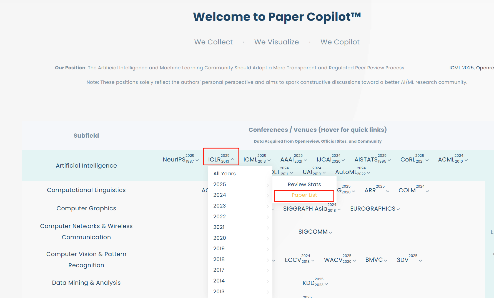
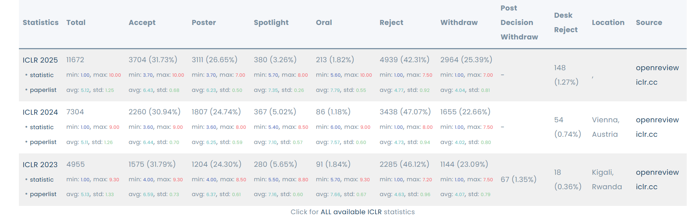
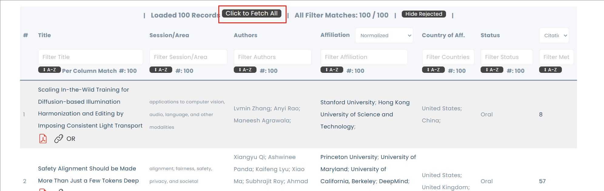
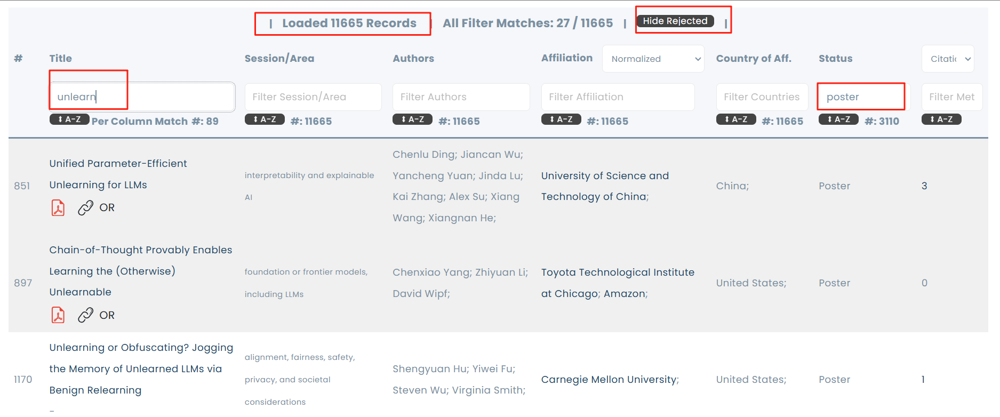
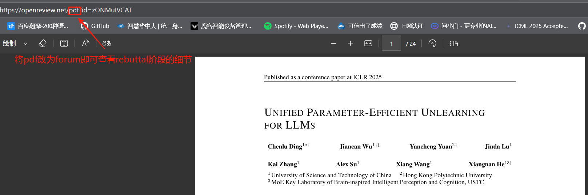

### 大家可以使用Papercopilot网站来检索顶会论文

- Step 1：进入网站
    ```
    https://papercopilot.com/
    ```

- Step 2: 找到要看的顶会
    

- Step 3: 让他爬取全部的论文并搜索你想读的论文

    这里可以看到历年的接受率
    

    点击这里得到全部论文
    

    然后就可以根据标题或者Track等信息进行检索和阅读了
    

- Step 4: 查看pdf和对应的rebuttal细节
    
    