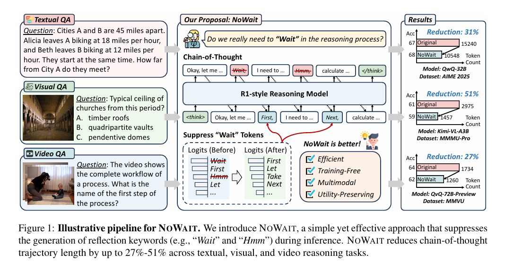
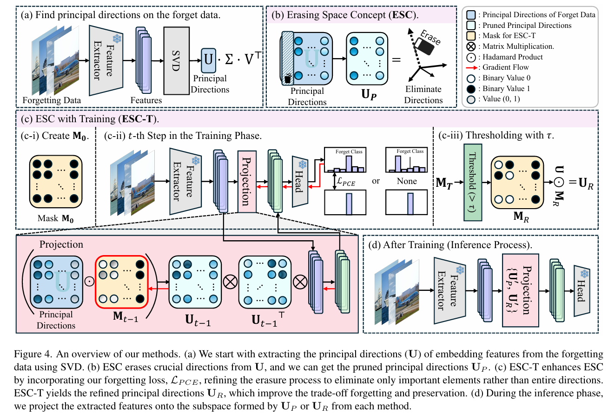
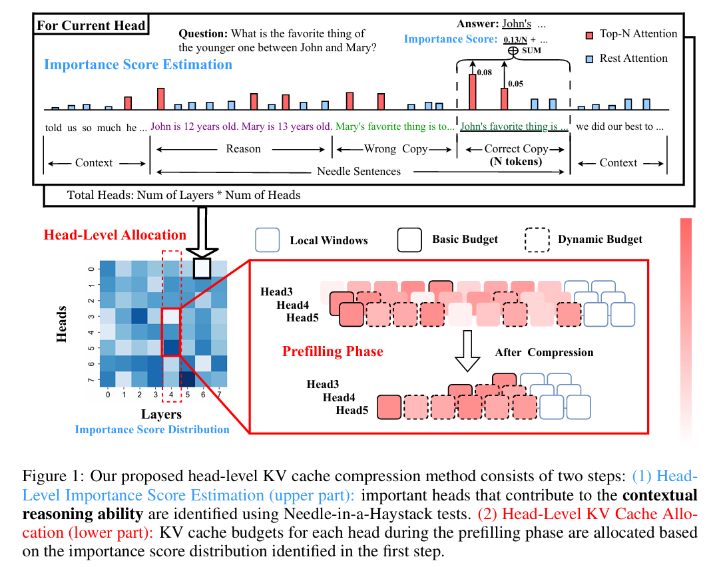
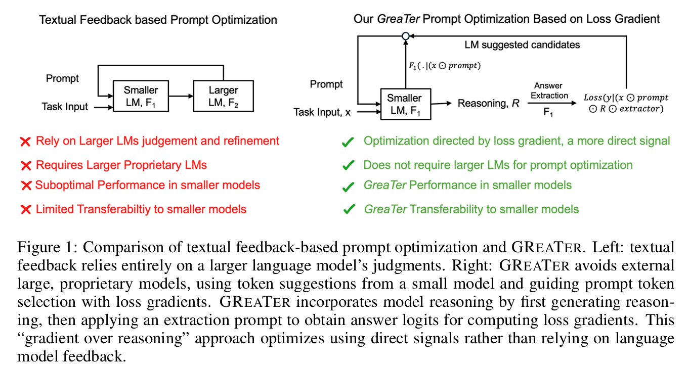
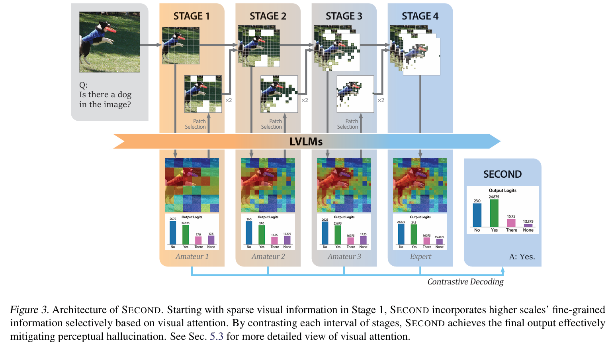
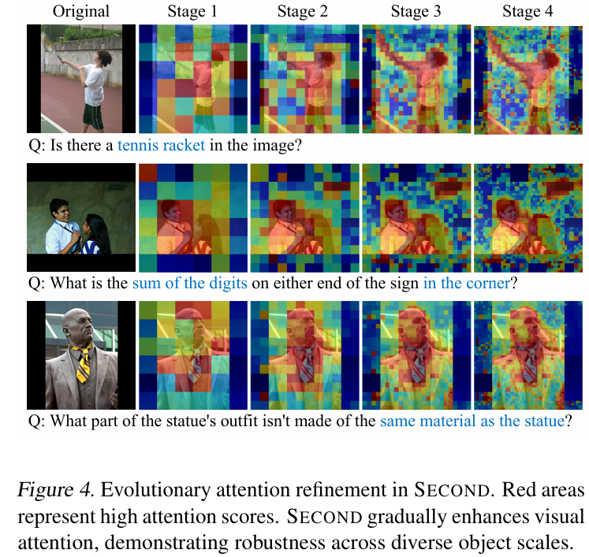
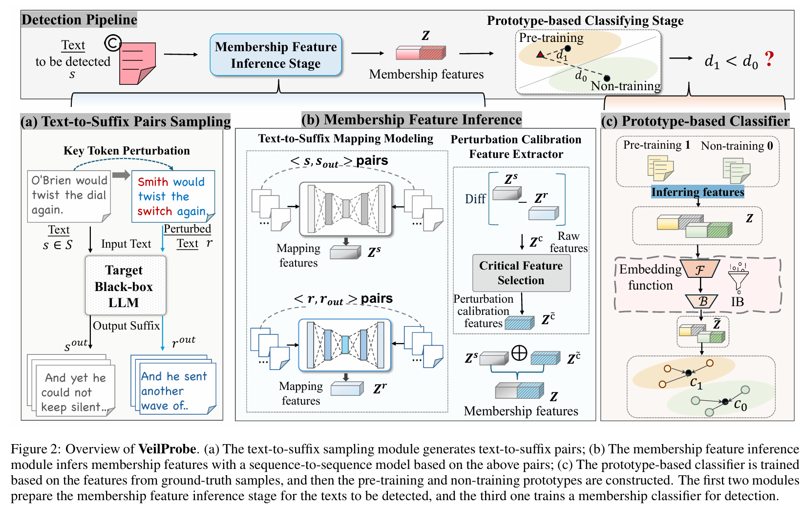
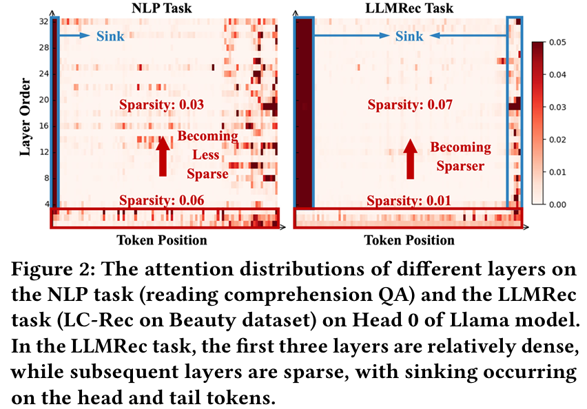
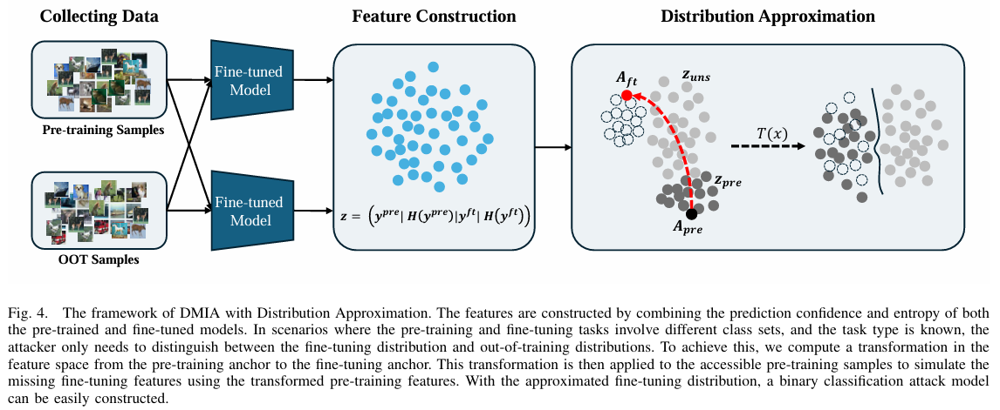

### Here I commit nice figures of core algorithms during my paper reading.

This image is the core algorithm image of [this paper](https://arxiv.org/pdf/2506.08343?).

This image is the core algorithm image of [this paper](https://arxiv.org/pdf/2504.02199).

This image is the core algorithm image of [this paper](https://openreview.net/pdf?id=FJFVmeXusW).

This image is the core algorithm image of [this paper](https://openreview.net/pdf?id=fWRBheSJth).

This image is the core algorithm image of [this paper](https://openreview.net/pdf?id=SbyrpBNNs4).

This image is the core algorithm image of [this paper](https://arxiv.org/pdf/2506.19399).

This image is the core algorithm image of [this paper](https://arxiv.org/pdf/2506.19399).

This image is the core algorithm image of [this paper](https://arxiv.org/pdf/2507.00715).

this image is the core algorithm image of [Distribution-based Membership Inference Attack on Pre
training and Fine-tuning Knowledge](Not Released).

